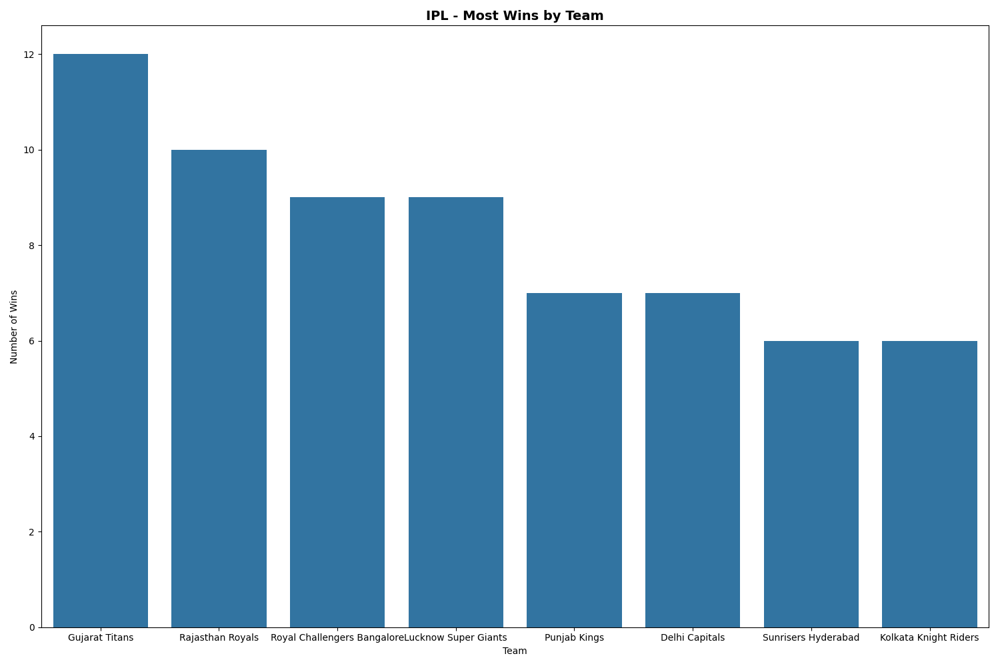
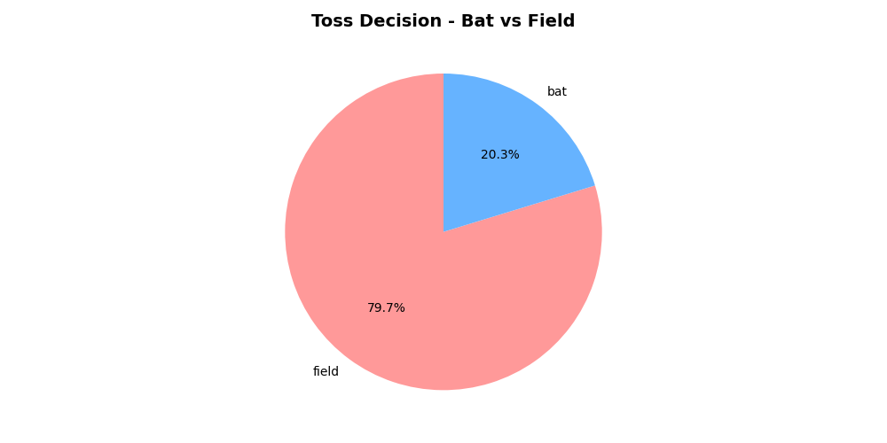
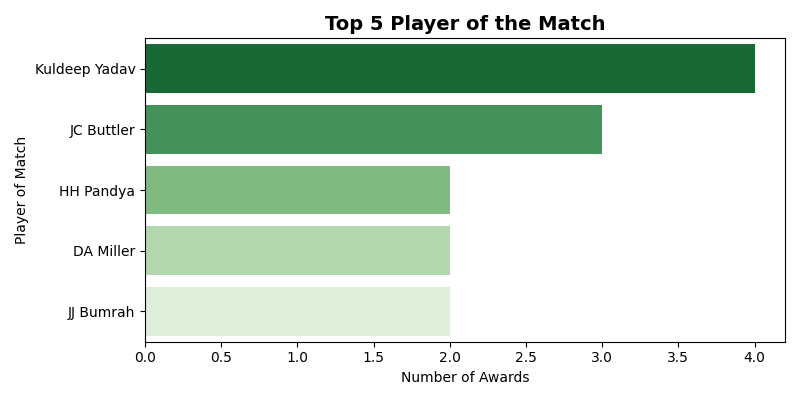

🏏 IPL Match Analysis — Python Data Analysis Project

📌 Project Overview
This project performs a complete Exploratory Data Analysis (EDA) on IPL (Indian Premier League) match data. The goal is to extract meaningful insights from raw cricket data using Python — covering data cleaning, analysis, and visualization.

📊 Dataset
PropertyDetailsSourceKaggle — IPL Matches DatasetRows74 matchesColumns20 featuresKey columnsTeam1, Team2, WinningTeam, TossWinner, TossDecision, Player_of_Match, City, Venue

🎯 Key Insights Discovered

🏆 Gujarat Titans won the most matches in this dataset
🎲 Toss result has minimal impact on match outcome — teams winning toss did NOT necessarily win the match
🏟️ Mumbai hosted the most IPL matches
🏅 Top Player of the Match winners identified across all games
🪙 Most teams prefer to field first after winning the toss

🛠️ Tech Stack
ToolPurposePython 3.xCore programming languagePandasData loading, cleaning, manipulationMatplotlibData visualization — charts and plotsSeabornStatistical visualizationsJupyter NotebookDevelopment environmentGit & GitHubVersion control

📁 Project Structure
ipl-analysis/
│
├── analysis.py          # Main analysis script
├── matches.csv          # IPL dataset
├── team_wins.png        # Chart 1 — Most wins by team
├── toss_decision.png    # Chart 2 — Toss decision pie chart
├── top_players.png      # Chart 3 — Top Player of the Match
└── README.md            # Project documentation

🔍 Steps Performed
1. Data Loading
pythonimport pandas as pd
df = pd.read_csv('matches.csv')
print(df.shape)   # 74 rows, 20 columns
2. Data Cleaning

Checked for null values using df.isnull().sum()
Dropped the method column (all 74 values were null — Duckworth-Lewis, rarely used)
Dataset was clean with no other missing values

3. Exploratory Data Analysis (EDA)

Most wins by team — value_counts()
Toss decision distribution — bat vs field
Does toss winner win the match? — Boolean comparison
Top Player of the Match winners
Most matches hosted by city

4. Data Visualization

Bar Chart — Top 8 teams by number of wins
Pie Chart — Toss decision: Bat vs Field percentage
Horizontal Bar — Top 5 Player of the Match winners

Chart 1 — Most Wins by Team

Chart 2 — Toss Decision

Chart 3 — Top Players of the Match

▶️ How to Run
1. Clone the repository
bashgit clone https://github.com/rk00009/ipl-analysis.git
cd ipl-analysis
2. Install dependencies
bashpip install pandas matplotlib seaborn
3. Run the analysis
bashpython analysis.py

📚 What I Learned

How to load and explore real-world datasets using Pandas
Data cleaning techniques — handling null values, dropping irrelevant columns
Performing EDA to extract meaningful business insights
Building professional visualizations using Matplotlib and Seaborn
Using Git and GitHub for version control